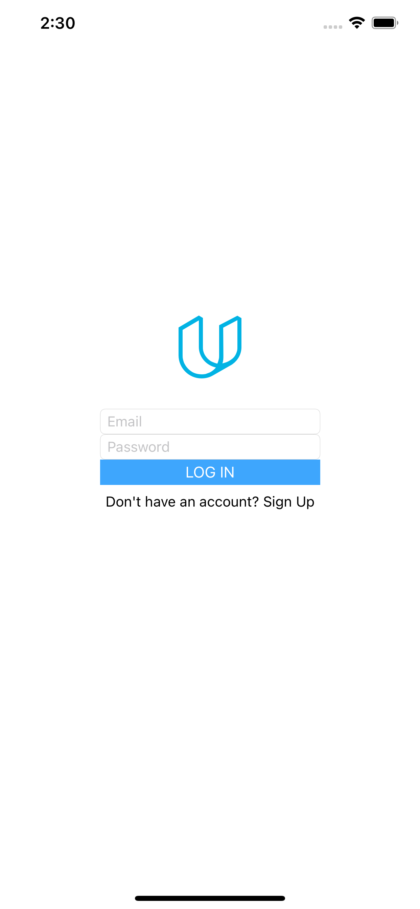
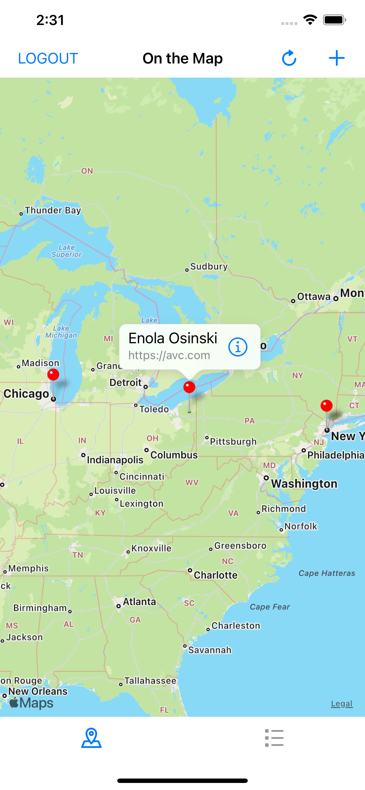
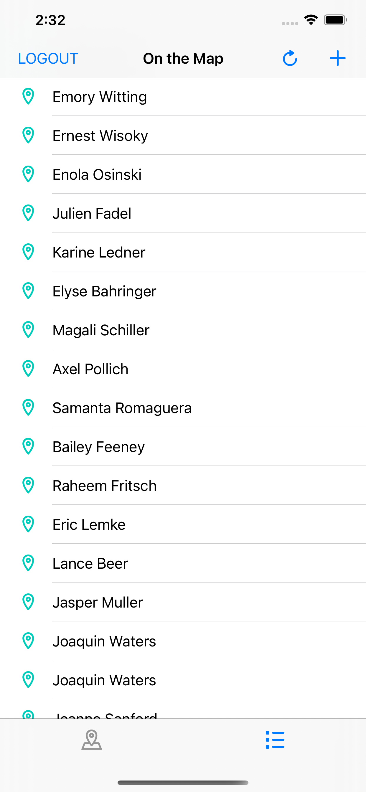
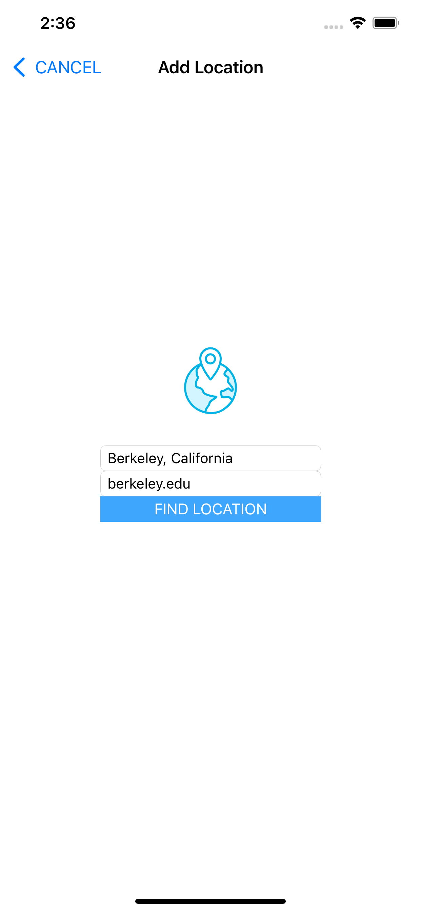
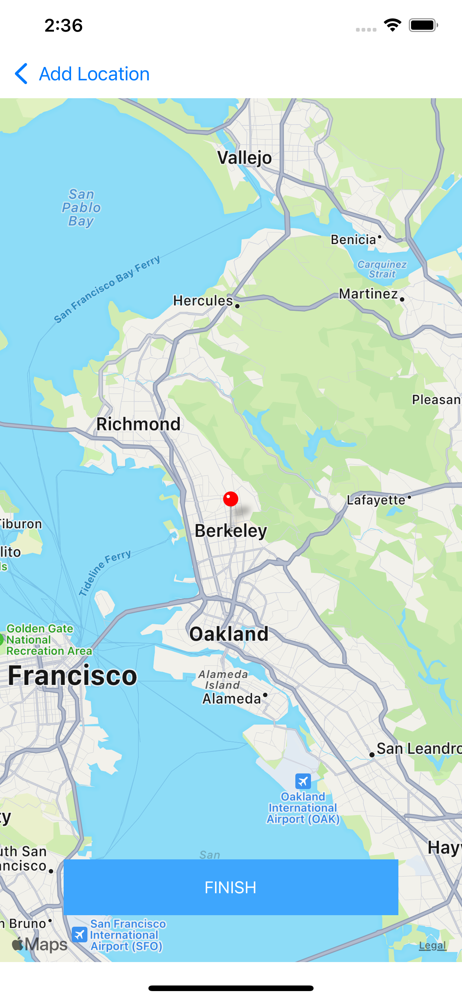

# On-The-Map
This is an iOS app that allows users to share their location and a URL with their fellow students on Udacity.
To visualize this data, On The Map uses a map with pins for location and pin annotations for student names and URLs, 
allowing students to place themselves “on the map."

# Getting Started
Make sure that you have the latest version of Xcode and Swift installed. To use the app, you will need to use an existing
Udacity account or create one at [udacity.com](udacity.com). After cloning/downloading the project, run it in your version
of Xcode using the device simulator of your choice.

# Using The App
## Logging In

  

The login view accepts the email address and password that students use to login to the Udacity site.
When the user taps the Login button, the app will attempt to authenticate with Udacity’s servers.
If the connection is made and the email and password are good, the app will segue to the Map and Table Tabbed View.

## Map and Table of Recent Location Additions

  
&nbsp; &nbsp; &nbsp; &nbsp;
  

This view has two tabs at the bottom: one specifying a map, and the other a table.
When the map tab is selected, the view displays a map with pins specifying the last 100 locations posted by students.
The user is able to zoom and scroll the map to any location using standard pinch and drag gestures.
When the user taps a pin, it displays the pin annotation popup, with the student’s name (pulled from their Udacity profile) 
and the link associated with the student’s pin. Tapping anywhere within the annotation will launch Safari and direct it to 
the link associated with the pin. When the table tab is selected, the most recent 100 locations posted by students are displayed 
in a table. Each row displays the name from the student’s Udacity profile. Tapping on the row launches Safari and opens the link 
associated with the student. Clicking on the refresh button will refresh the entire data set by downloading and displaying the 
most recent 100 posts made by students. Clicking on the pin button will modally present the Information Posting View.

## Information Posting View

  
&nbsp; &nbsp; &nbsp; &nbsp;
  

The Information Posting View allows users to input their location and chosen link. When the user clicks on the “Find Location” 
button, the app will forward geocode the string. If the forward geocode fails, the app will display an alert view notifying the user. 
Likewise, an alert will be displayed if the link is empty. If the forward geocode succeeds then text fields will be hidden, and a map 
showing the entered location will be displayed. Tapping the “Finish” button will post the location and link to the server.
If the submission fails to post the data to the server, then the user should see an alert with an error message describing the failure.

# Special Note
After adding your own location and link, make sure to tap the refresh button to see the updated map or table.
